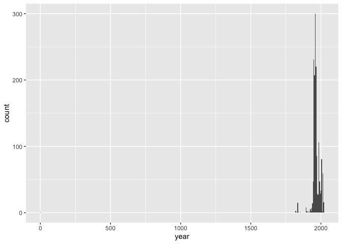
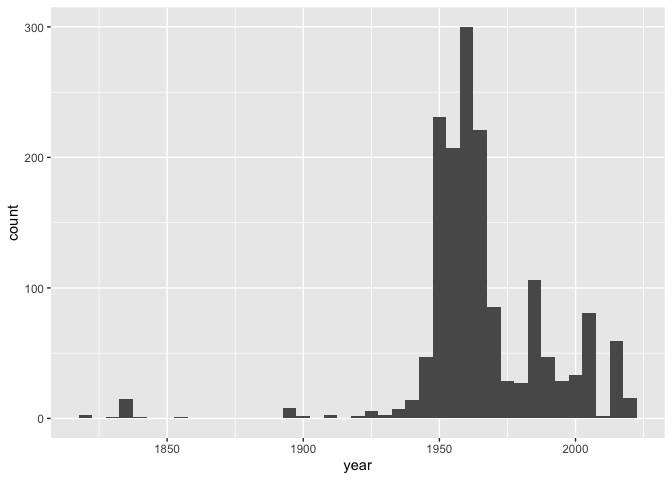

Lab 08 - University of Edinburgh Art Collection
================
Lindsey Wilson
4/21/23

### Load packages and data

``` r
library(tidyverse) 
library(skimr)
library(robotstxt)
```

``` r
# Remove eval = FALSE or set it to TRUE once data is ready to be loaded
uoe_art <- read_csv("data/uoe-art.csv")
```

### Exercise 10

Lets go ahead and wrangle our data to separate the `title` variable into
`title` and `year`

``` r
uoe_art <- uoe_art %>%
  separate(title, into = c("title", "date"), sep = "\\(" ) %>%
  mutate(year = str_remove(date, "\\)") %>% as.numeric()) %>%
  select(title, artist, year, link)
```

    ## Warning: Expected 2 pieces. Additional pieces discarded in 39 rows [68, 211, 346, 658,
    ## 767, 782, 846, 891, 927, 979, 988, 1030, 1057, 1101, 1150, 1170, 1238, 1304,
    ## 1324, 1334, ...].

    ## Warning: Expected 2 pieces. Missing pieces filled with `NA` in 650 rows [2, 3, 5, 7, 13,
    ## 22, 34, 47, 49, 52, 55, 61, 66, 70, 94, 112, 119, 121, 125, 126, ...].

    ## Warning in str_remove(date, "\\)") %>% as.numeric(): NAs introduced by coercion

The reason we aren’t concerned about the error messages here is that
they all either indicate 1.) that there was extra information in the
string we aren’t concerned about capturing, or. 2.) that there were no
parentheses at all in the string so there wasn’t any date to capture.

### Exercise 11

Let’s skim our data:

``` r
skim(uoe_art)
```

|                                                  |         |
|:-------------------------------------------------|:--------|
| Name                                             | uoe_art |
| Number of rows                                   | 3017    |
| Number of columns                                | 4       |
| \_\_\_\_\_\_\_\_\_\_\_\_\_\_\_\_\_\_\_\_\_\_\_   |         |
| Column type frequency:                           |         |
| character                                        | 3       |
| numeric                                          | 1       |
| \_\_\_\_\_\_\_\_\_\_\_\_\_\_\_\_\_\_\_\_\_\_\_\_ |         |
| Group variables                                  | None    |

Data summary

**Variable type: character**

| skim_variable | n_missing | complete_rate | min | max | empty | n_unique | whitespace |
|:--------------|----------:|--------------:|----:|----:|------:|---------:|-----------:|
| title         |         1 |          1.00 |   0 |  95 |     8 |     1388 |          0 |
| artist        |       115 |          0.96 |   2 |  55 |     0 |     1116 |          0 |
| link          |         0 |          1.00 |  57 |  60 |     0 |     3017 |          0 |

**Variable type: numeric**

| skim_variable | n_missing | complete_rate |    mean |    sd |  p0 |  p25 |  p50 |  p75 | p100 | hist  |
|:--------------|----------:|--------------:|--------:|------:|----:|-----:|-----:|-----:|-----:|:------|
| year          |      1431 |          0.53 | 1964.38 | 55.47 |   2 | 1953 | 1962 | 1979 | 2020 | ▁▁▁▁▇ |

As we can see here, there are 115 pieces with artist info missing and
1431 pieces with year information missing.

### Exercise 12

``` r
ggplot(uoe_art, aes(x = year)) +
  geom_histogram(binwidth = 5)
```

    ## Warning: Removed 1431 rows containing non-finite values (`stat_bin()`).

<!-- -->

It looks like we have one data point with a `year` value of 2, which
causes the scaling issue on the x-axis. Filtering that piece out should
fix the problem:

``` r
uoe_art %>%
  filter(year > 5) %>%
  ggplot(aes(x = year)) +
  geom_histogram(binwidth = 5)
```

<!-- -->

### Exercise 13

The title of the out of ordinary piece is “Death Mask (2) (1964)”.
Therefore, it looks like what happened is that our code split the title
on the first opening parenthesis, and threw away the data after the
first closing parenthesis. This captured the “2”, but resulted in the
“1964” being thrown away.

I’ve fixed the issue below. If I did it right, the new histogram should
look essentially just like the old one but without having to do any
filtering first:

``` r
uoe_art <-  uoe_art %>%
  mutate(year = if_else(link == "https://collections.ed.ac.uk/art/record/21649?highlight=*:*",
                        1964,
                        uoe_art$year,
                        missing = NULL))

ggplot(uoe_art, aes(x = year)) +
  geom_histogram(binwidth = 5)
```

    ## Warning: Removed 1431 rows containing non-finite values (`stat_bin()`).

<!-- -->

### Exercise 14

Next we want to know who the most commonly featured artist in the
collection is. Generating a frequency table should let us answer that
question:

``` r
freq <- table(uoe_art$artist) %>%
  sort(decreasing = TRUE) %>%
  data.frame()

head(freq)
```

    ##               Var1 Freq
    ## 1          Unknown  357
    ## 2     Emma Gillies  177
    ## 3     John Bellany   22
    ## 4       Ann F Ward   19
    ## 5      Boris Bućan   17
    ## 6 Marjorie Wallace   17

It looks like (besides Unknown), Emma Gillies is the most commonly
represented artist in the collection, with 177 pieces. This makes sense
after some Googling: Gillies is from Edinburgh, and has had an exhibit
of her work featured at the University of Edinburgh library.

### Exercise 15

Let’s see how many exhibits contain the word “Child” in the title:

``` r
#create a vector containing whether or not each item has "child" in title
child <- uoe_art$title %>%
  str_detect("(?i)child") %>%
  as.vector()

# mutate uoe_art to add above vector as a column
uoe_art <- uoe_art %>%
  mutate(child_in_title = child)

#filter uoe_art and count the rows that make it through filter
uoe_art %>%
  filter(child_in_title == TRUE)
```

    ## # A tibble: 11 × 5
    ##    title                                              artist  year link  child…¹
    ##    <chr>                                              <chr>  <dbl> <chr> <lgl>  
    ##  1 "Child's collar. Chinese"                          Unkno…    NA http… TRUE   
    ##  2 "Untitled - Children Playing "                     Monik…  1963 http… TRUE   
    ##  3 "Virgin and Child"                                 Unkno…    NA http… TRUE   
    ##  4 "Virgin and Child "                                Unkno…    NA http… TRUE   
    ##  5 "The Children's Hour "                             Eduar…    NA http… TRUE   
    ##  6 "Figure Composition with Nurse and Child, and Wom… Edwar…    NA http… TRUE   
    ##  7 "Child's chinese headdress"                        Unkno…    NA http… TRUE   
    ##  8 "Woman with Child and Still Life "                 Cathe…  1938 http… TRUE   
    ##  9 "Virgin and Child "                                Unkno…    NA http… TRUE   
    ## 10 "Untitled - Portrait of a Woman and Child "        Willi…    NA http… TRUE   
    ## 11 "The Sun Dissolves while Man Looks Away from the … Eduar…    NA http… TRUE   
    ## # … with abbreviated variable name ¹​child_in_title

It looks like there are 11 items with “child” in the title!
